# LMS Desktop (Team: The Trio)

A desktop application that lets the faculties, students and admin to interact with their privilege and responsibilities.

## Features

- Admin, Faculty & Student Login
- Admin can add, edit, delete faculties and students
- Faculty can add, edit, delete courses and students
- Student can view courses and enroll in courses
- Faculty can add tasks and students can submit tasks
- Faculty can add grades and students can view grades
- Faculty & Student can view their profile
- Students can chat with multiple students, but the faculty needs to approve the chat request for group chat
- Students get notifications when a new task is arrived in the LMS
- Everyone gets secured personal storage
- Has nice calculator application in it that can be detached and use separately as well.

## Installation

**For Server, `ChatServer.java`. For Client, `ChatClient.java`.**

** VM option - `--module-path "C:\Program Files\Java\javafx-sdk-17.0.6\lib" --add-modules javafx.controls,javafx.fxml`

## Screenshots

- Main LandingPage/Homepage

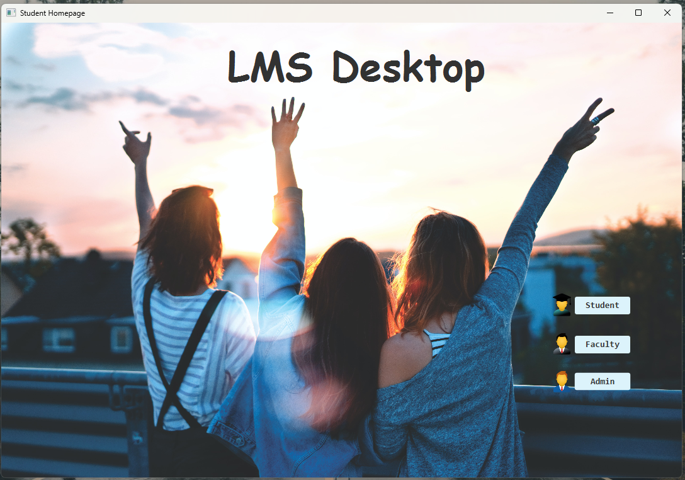

- Student Portal's LandingPage/Homepage

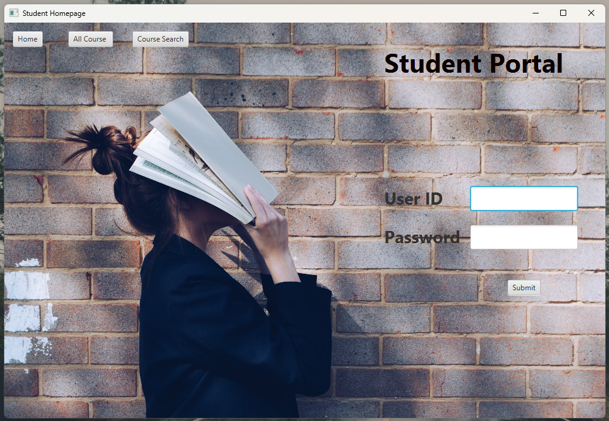

- Faculty Portal's LandingPage/Homepage

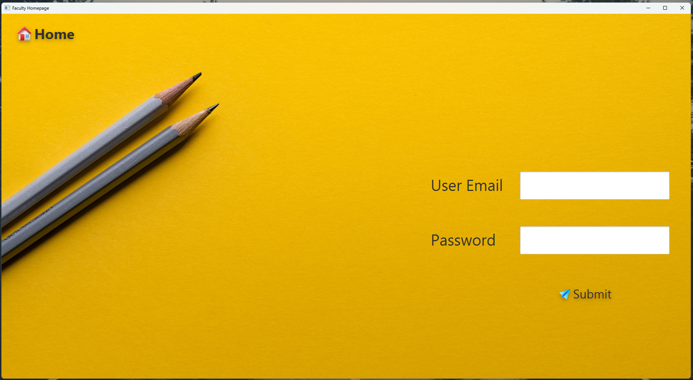

- Admin Portal's LandingPage/Homepage

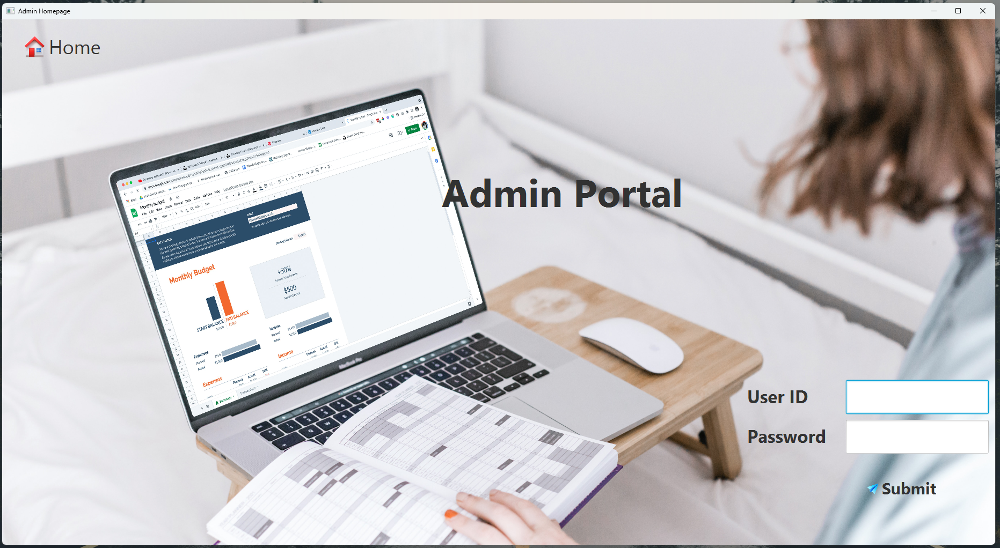

- Wrong Credentials (separate warning window)

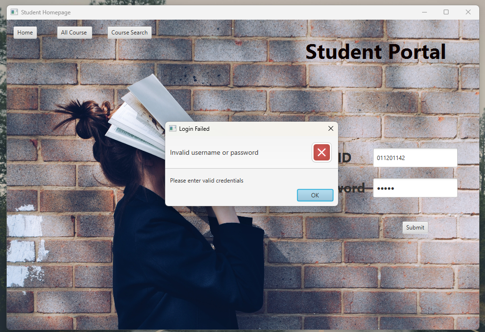

- Faculty LMS (During hidden sidebar)

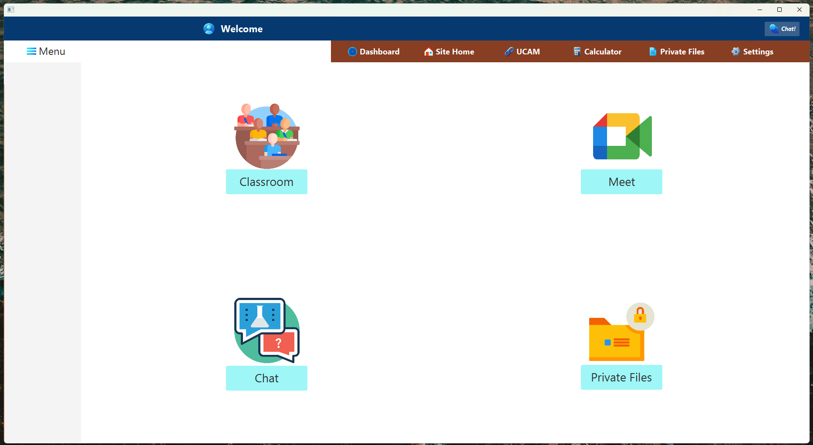

- Faculty LMS (During enabled sidebar)

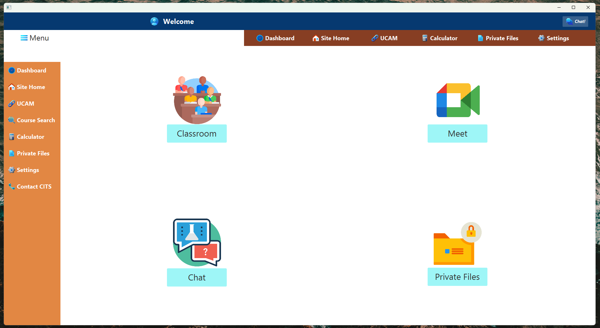

- Faculty Course View

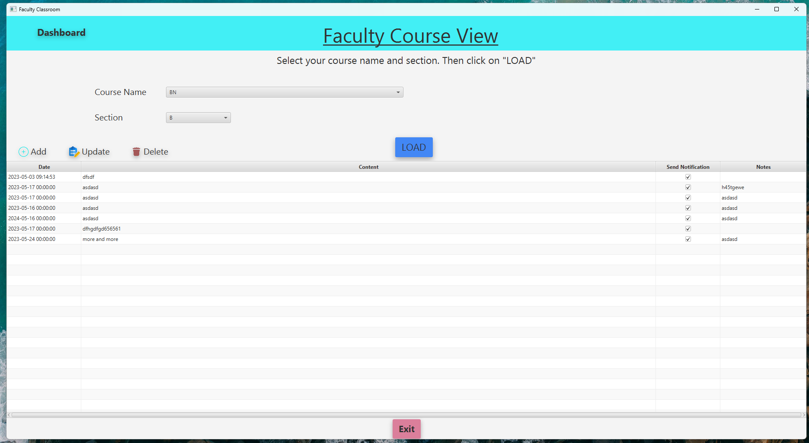

- Faculty Course Content Update

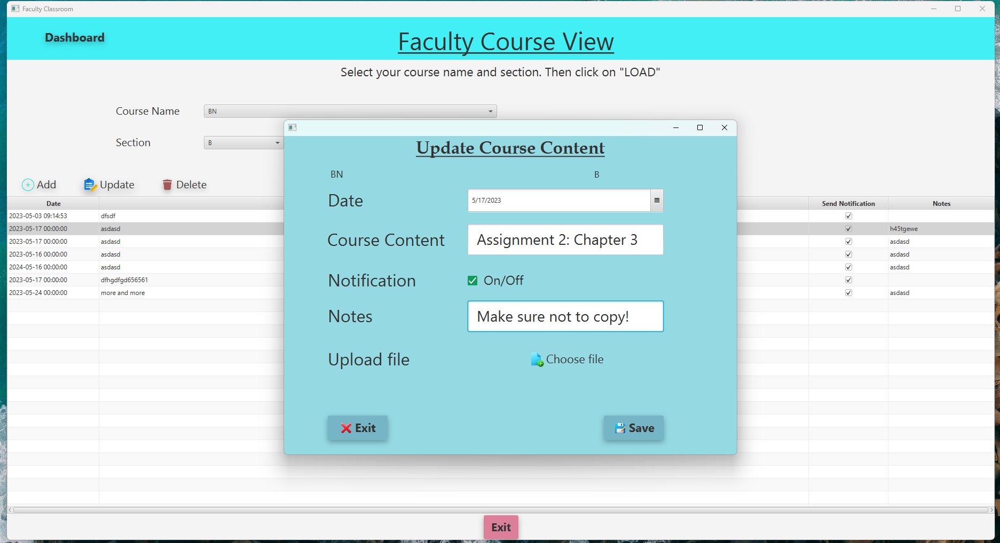

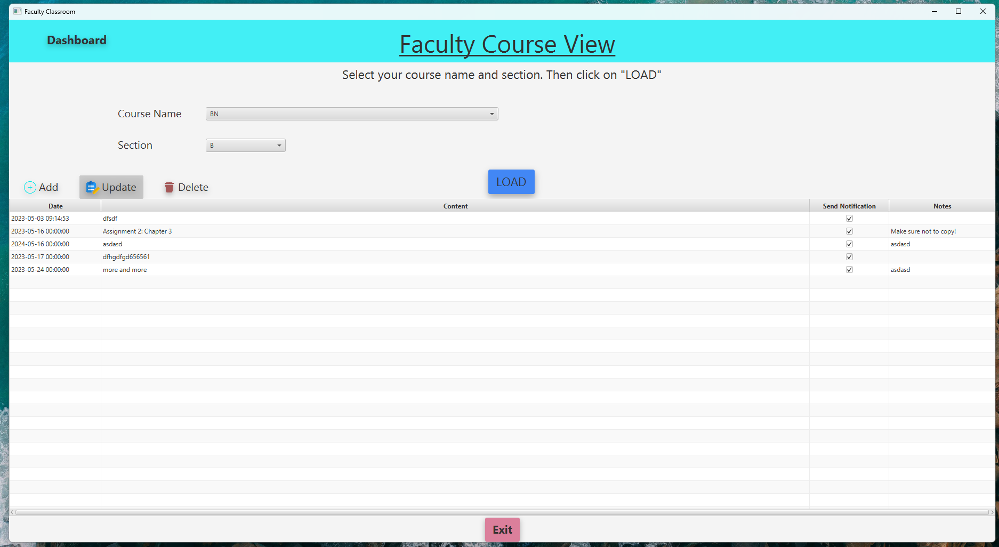

- Faculty Course Content Add (I purposely added some gibberish content here. Don't worry! In the next step, I will delete them, and I will also show you whether the delete content feature is working or not!)

https://github.com/FahimFBA/LMS_Desktop/assets/64195132/b3bf25b0-d1be-4062-9579-28e16acc01fb

- Faculty Course Content Delete

https://github.com/FahimFBA/LMS_Desktop/assets/64195132/6fc0b8cf-65db-45d6-a54c-a116eec88aa6

- Faculty Slider

https://github.com/FahimFBA/LMS_Desktop/assets/64195132/148df098-499e-47b6-bc29-32fffdaf92a5

- A nice standalone calculator integrated to LMS Desktop

https://github.com/FahimFBA/LMS_Desktop/assets/64195132/70c8b435-04bc-4e43-8442-9fd2a633acb5

- Chat System (The teacher must need to start the server so that the students can chat among them. Teacher can see all the chat so that they are not cheating during the exams! The teacher can generate the event log as `.xlsx` file.) - ***TCP based Chat System has been applied here!***

https://github.com/FahimFBA/LMS_Desktop/assets/64195132/daf16b3e-811d-4cf7-a29c-9874df23f1eb

The `.xlsx` file generated in the above video is right [here](./eventLogs/eventLogs_2024-05-31-11-30-33.xlsx).

- Student Signup

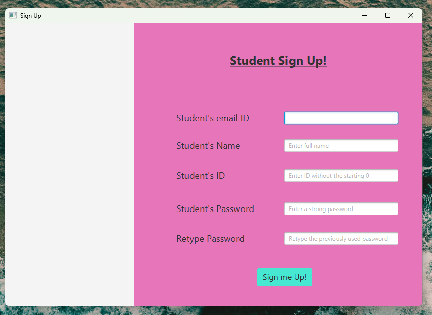

- Student Signup Successful Window

This window gets displayed if the user's new account gets created successfully.

https://github.com/FahimFBA/LMS_Desktop/assets/64195132/2a299a68-2f96-48e3-b6b1-2f140073848b

- Student Signup Fail Window

This window gets displayed if the user do something wrong during the creation of the account (i.e, The password does not match in the `Retype Password` section, etc.)

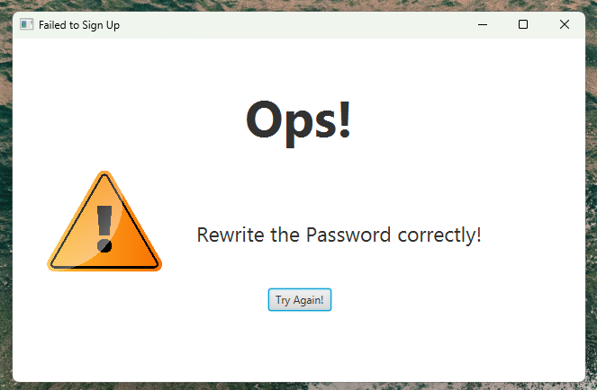

- Student Course View

https://github.com/FahimFBA/LMS_Desktop/assets/64195132/6cc338b8-5e07-4ffd-943a-042ffeb97f9c

## Team Members

- [Md. Fahim Bin Amin](https://github.com/FahimFBA) - Team Leader
- [Israt Jahan Khan](https://github.com/IsratIJK)
- [Sifat Ullah Adnan](https://github.com/SifatAdnan9)